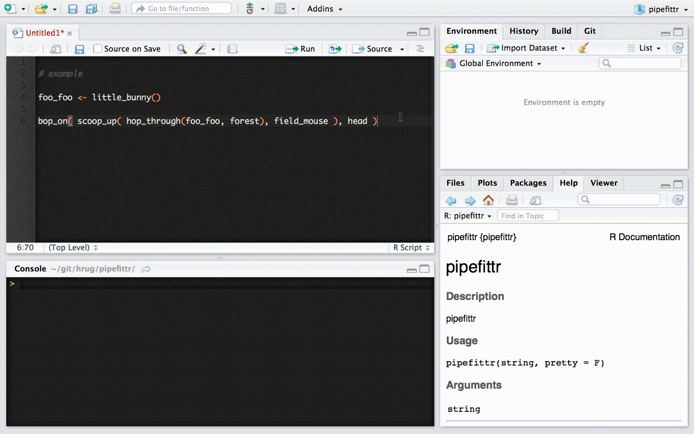

# pipefittr

[](https://travis-ci.org/HoustonUseRs/pipefittr/jobs/131320732)


a function in R to take nested function calls and convert them to a more readable form using [magrittr](https://github.com/smbache/magrittr)'s pipes.


## Examples:
**e.g. (example taken from [Hadley Wickham](https://github.com/hadley))**

calling the add-in on:

    foo_foo <- little_bunny()
    bop_on( scoop_up( hop_through(foo_foo, forest), field_mouse ), head )
    

will return:

    foo_foo <- little_bunny()
    foo_foo %>% 
      hop_through(forest) %>% 
      scoop_up(field_mouse) 
      %>% bop_on(head)
    



**another example**

ostensibly, the (same?) function would also be able to remedy horrendous situations like this:

    tmp_bunny1 <- foo_foo
    tmp_bunny2 <- hop_through(tmp_bunny1, forest)
    tmp_bunny3 <- scoop_up(tmp_bunny2, field_mouse)
    tmp_bunny4 <- bop_on(tmp_bunny3, head)
    
this would resolve to:

    foo_foo <- little_bunny()
    tmp_bunny4 <- foo_foo %>% 
      hop_through(forest) %>% 
      scoop_up(field_mouse) 
      %>% bop_on(head)
    
same as above with the minor difference that it would now be assigned to `tmp_bunny4`. 
It can be up to the user to change that later.

### installation

```
devtools::install_github("houstonusers/pipefittr")
```

### some disorganized ideas on how the function could work:

steps:

1. collapse all new-lines within parentheses
2. parse the order of operations
3. construct and return the pipe
